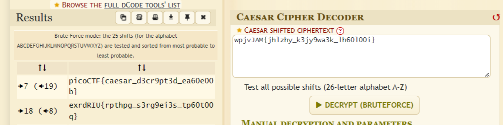

```
┌──(kali㉿kali)-[~/Desktop/picoctf]
└─$ cat enc_flag | base64 -d
b'd3BqdkpBTXtqaGx6aHlfazNqeTl3YTNrX2xoNjBsMDBpfQ=='

┌──(kali㉿kali)-[~/Desktop/picoctf]
└─$ echo "d3BqdkpBTXtqaGx6aHlfazNqeTl3YTNrX2xoNjBsMDBpfQ==" | base64 -d                                                   
wpjvJAM{jhlzhy_k3jy9wa3k_lh60l00i}
```

<figure></figure>

Flag:
```
picoCTF{caesar_d3cr9pt3d_ea60e00b}
```