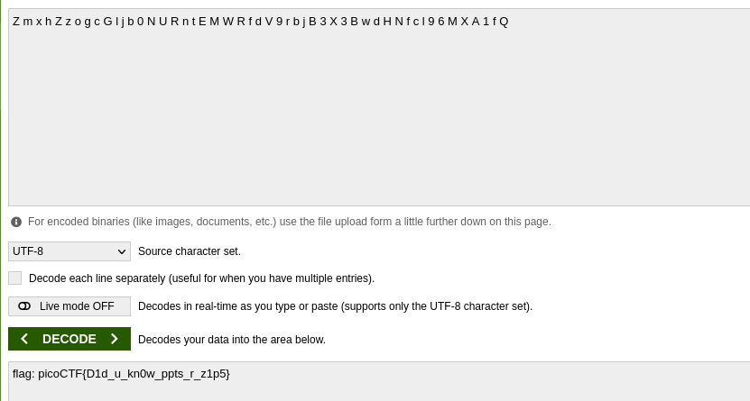

On getting all the files from the `.pptm` using binwalk. I found base64 encoded string here.

<figure></figure>

On decoding it we got the flag.

<figure></figure>

Flag:
```
picoCTF{D1d_u_kn0w_ppts_r_z1p5}
```