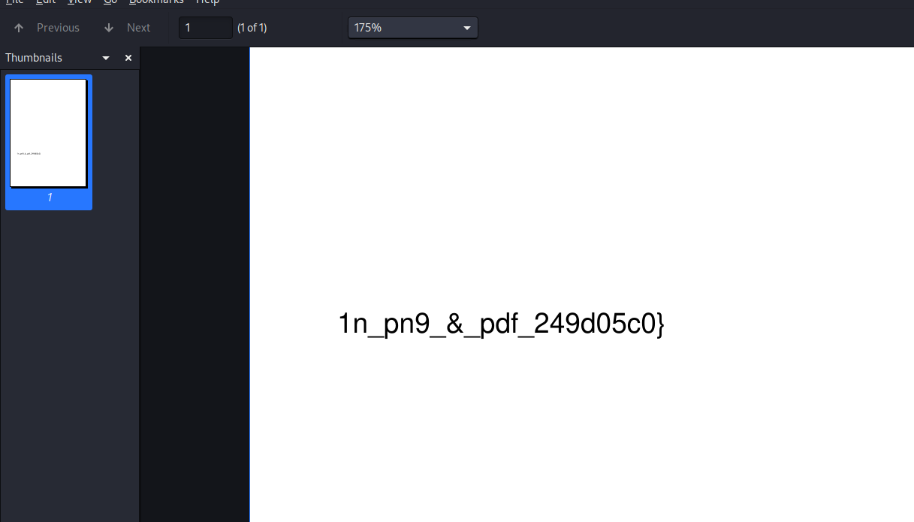
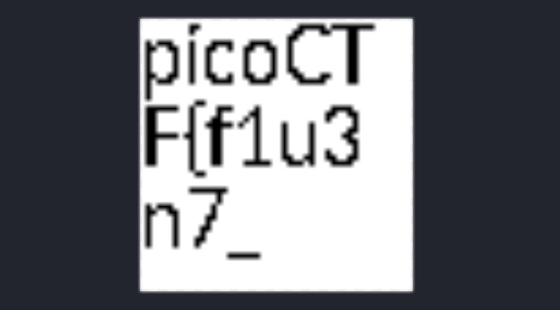

Got a file named `flag2of2-final.pdf`. On opening the pdf there was half part of the flag which was the end of the flag.

<figure></figure>

On reading the hexdump of the pdf there was png headers. 

Renamed the pdf to png and got the first part of the flag.

<figure></figure>

Flag:
```
picoCTF{f1u3n7_1n_pn9_&_pdf_249d05c0}
```