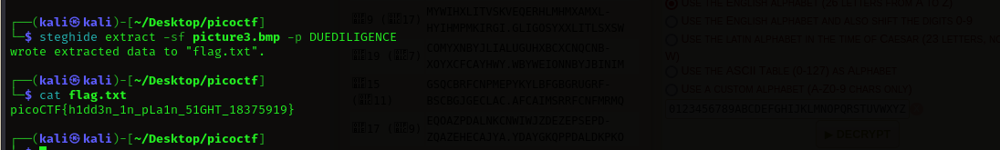

Using `tftp.type`, I was able to extract the file from wireshark.

<figure></figure>

Exported all the files and decoded the strings using ROT13.

<figure></figure>

Flag:
```
picoCTF{h1dd3n_1n_pLa1n_51GHT_18375919}
```