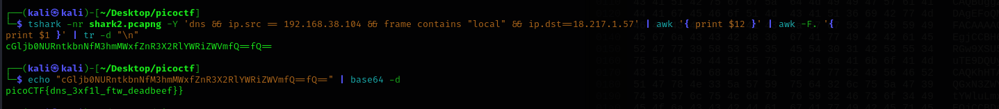

Applying filter `dns and ip.dst==18.217.1.57` to see DNS requests. The subdomain of `reddshrimpandherring.com` and append them in order we get the base64 encoded flag.

<figure></figure>

Flag:
```
picoCTF{dns_3xf1l_ftw_deadbeef}
```