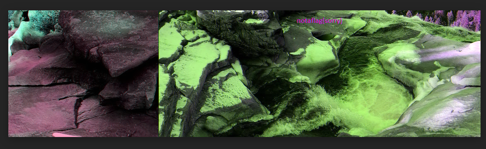
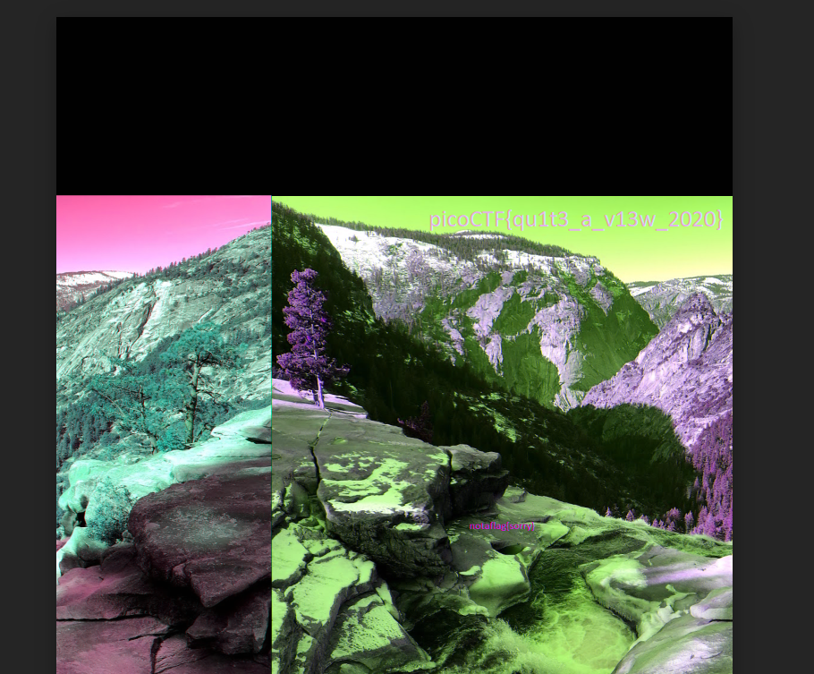

We can open the image in photopea.

<figure></figure>

But this does not give the right flag although, I changed the height of the image from the hex editor to `6E 04`.

<figure></figure>

Flag:
```
picoCTF{qu1t3_a_v13w_2020}
```