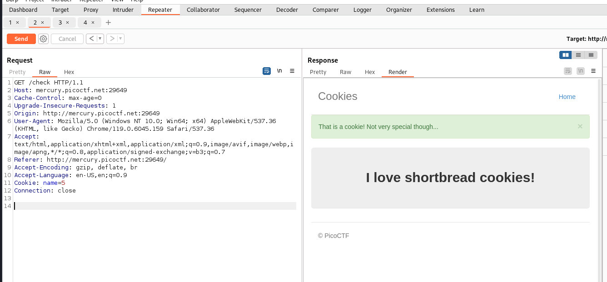
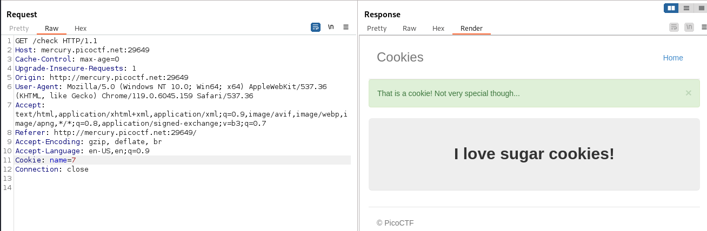
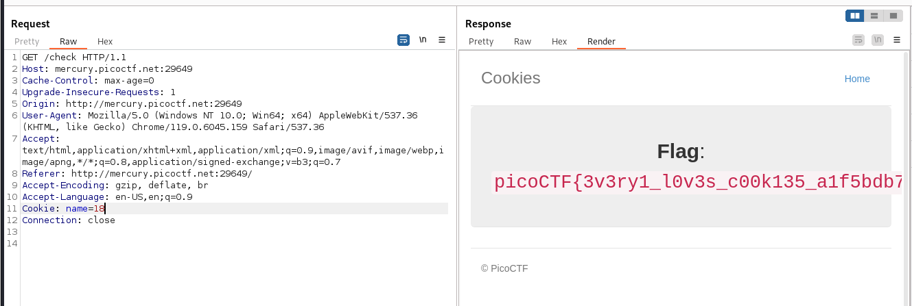

In the headers if we bruteforce the parameter, we get a list of cookies which are listed.

For examples:
<figure></figure>

<figure></figure>

On the `18` number the page spits out the flag.

<figure></figure>


Flag:
```
picoCTF{3v3ry1_l0v3s_c00k135_a1f5bdb7}
```