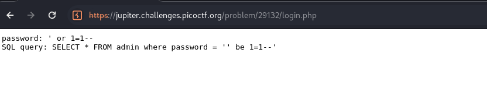
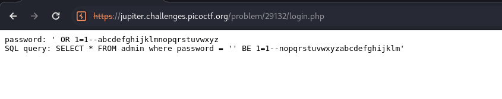
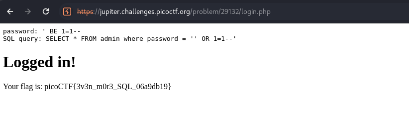

It can be seen that the query I put `' OR 1=1--` has been registered as `' br 1=1--`. 

<figure></figure>

I put in another query `' OR 1=1--abcdefghijklmnopqrstuvwxyz` to see which letter have been replaced with which letters. 

<figure></figure>

Then I put in the query `' BE 1=1--` and got the flag.

<figure></figure>

Flag:
```
picoCTF{3v3n_m0r3_SQL_06a9db19}
```