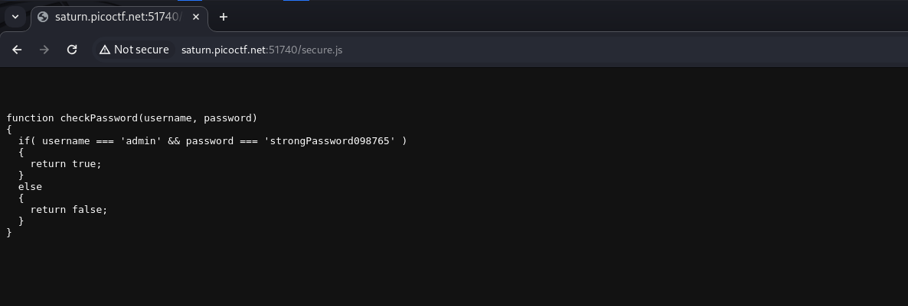
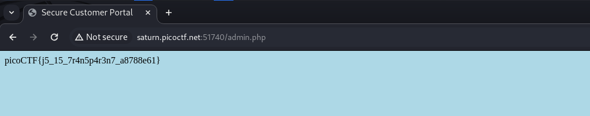

Found the credentials in `secure.js` which was being accessed everytime I entered false credentials.

<figure></figure>

I got the flag after entering the right credentials.

<figure></figure>

Flag:
```
picoCTF{j5_15_7r4n5p4r3n7_a8788e61}
```