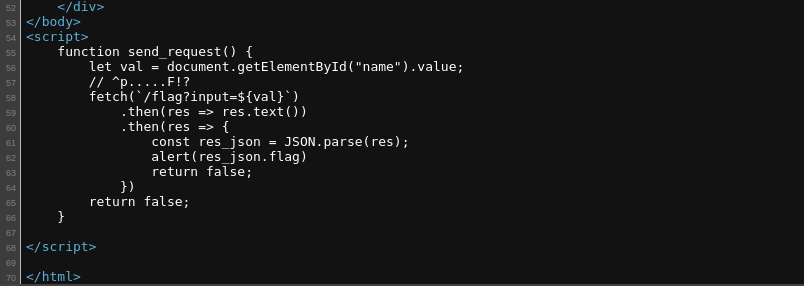
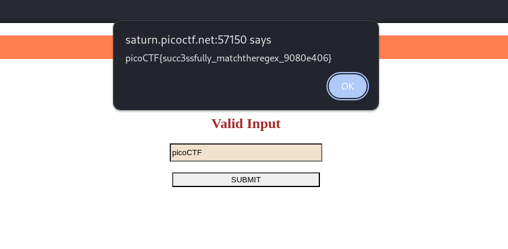

Inspected the source code, it takes input from the user and matches it with `/flag`.

<figure></figure>

Matched the flag format in the input and got the flag.

<figure></figure>

Flag:
```
picoCTF{succ3ssfully_matchtheregex_9080e406}
```