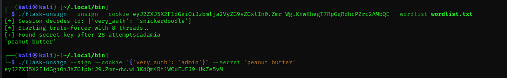
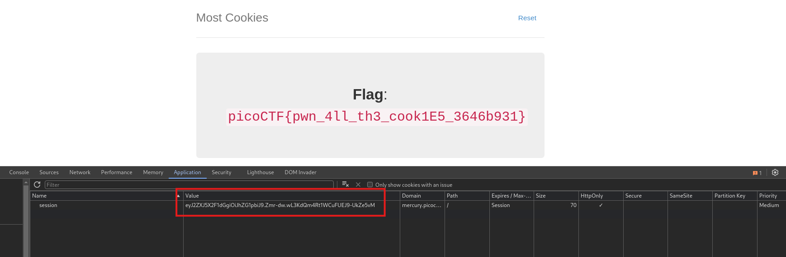

First I got the value of the cookie and I used the wordlist to bruteforce the secret key.

<figure></figure>

I crafted and signed a new token using the same secret to get the flag.

<figure></figure>

Flag:
```
picoCTF{pwn_4ll_th3_cook1E5_3646b931}
```