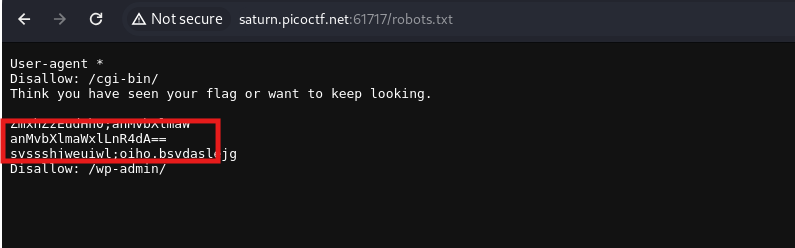
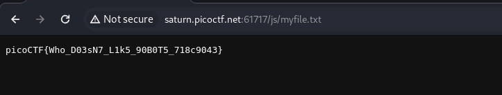

On robots.txt there was a base64 encoded string.

<figure></figure>

Which turned out to be `js/myfile.txt` through which I got the flag.

<figure></figure>

Flag:
```
picoCTF{Who_D03sN7_L1k5_90B0T5_718c9043}
```