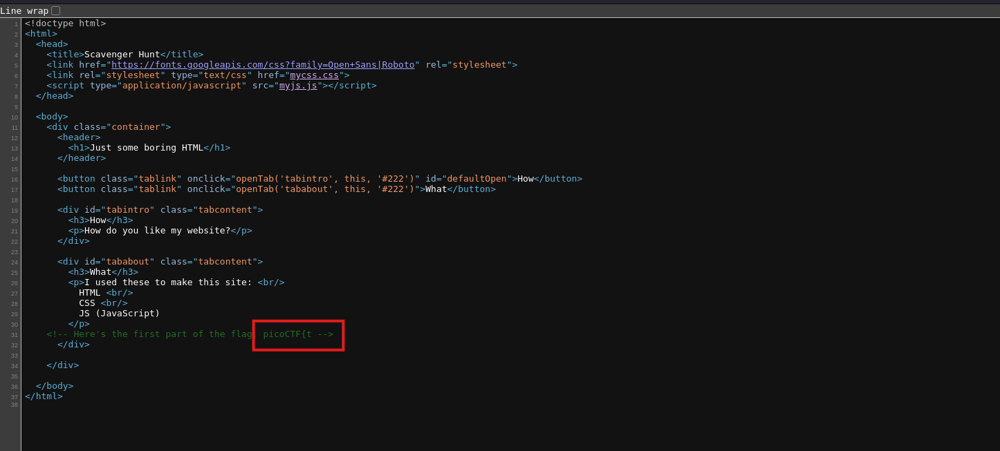
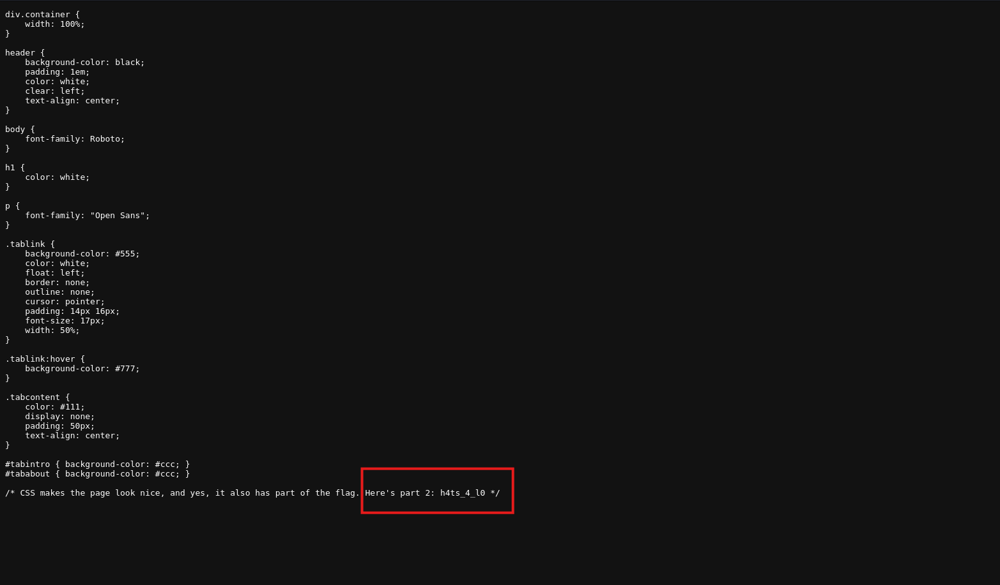
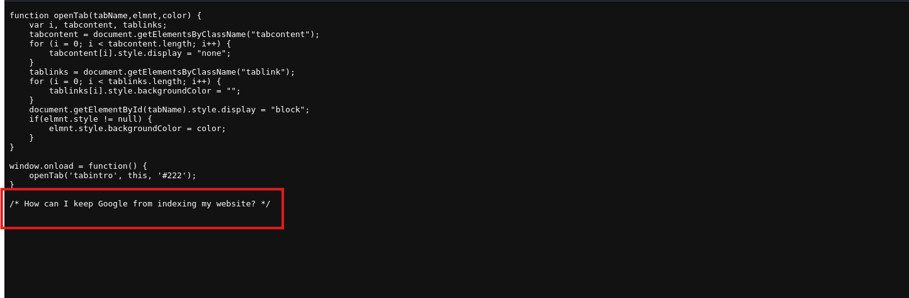
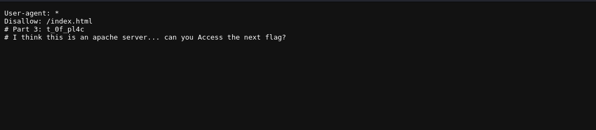
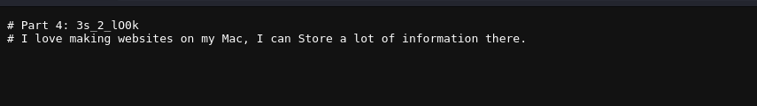
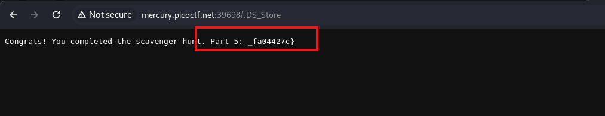

From inspecting the source code of the page and assets I got some parts of the flag.

<figure></figure>

The css file had the second part of the flag.

<figure></figure>

The js file said this so they're talking about `robots.txt`.

<figure></figure>

It had the third part of the flag and hint.

<figure></figure>

I assume they are talking about `.htaccess` since it's an apache server.

<figure></figure>

Since they're building on Mac, It add's the `DS_Store` file to all of the folders.

<figure></figure>

Flag:
```
picoCTF{th4ts_4_l0t_0f_pl4c3s_2_lO0k_fa04427c}
```