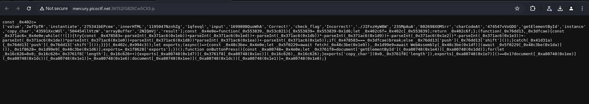
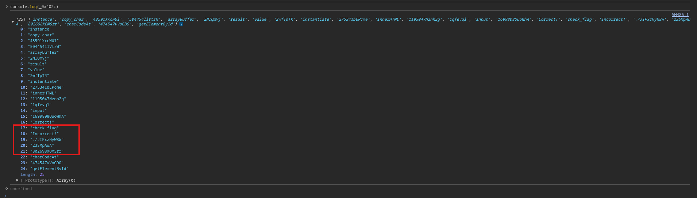
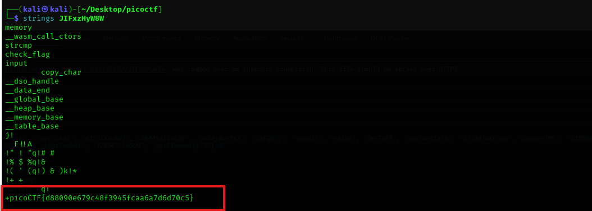

On inspecting the source code I found this js file.

<figure></figure>

I logged the variable in my console to see what it's doing and found that it goes to an interesting endpoint.

<figure></figure>

I downloaded the file from that endpoint and got the flag from the file.

<figure></figure>

Flag:
```
picoCTF{d88090e679c48f3945fcaa6a7d6d70c5}
```