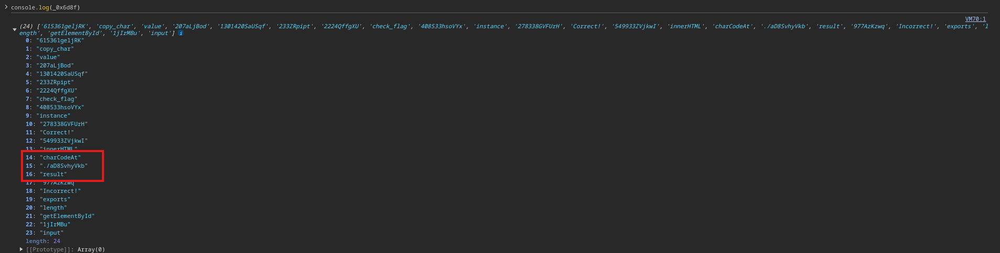
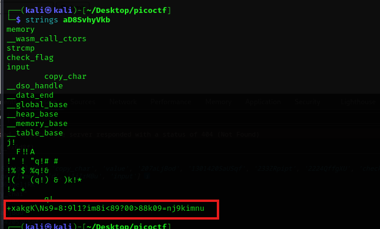
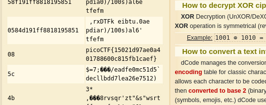

Inspecting the source code I found a function. I logged the function to get the values.

<figure></figure>

Downloaded the file and viewed it to find this string.

<figure></figure>

XOR'd the string to get the flag.

<figure></figure>

Flag:
```
picoCTF{15021d97ae0a401788600c815fb1caef}
```