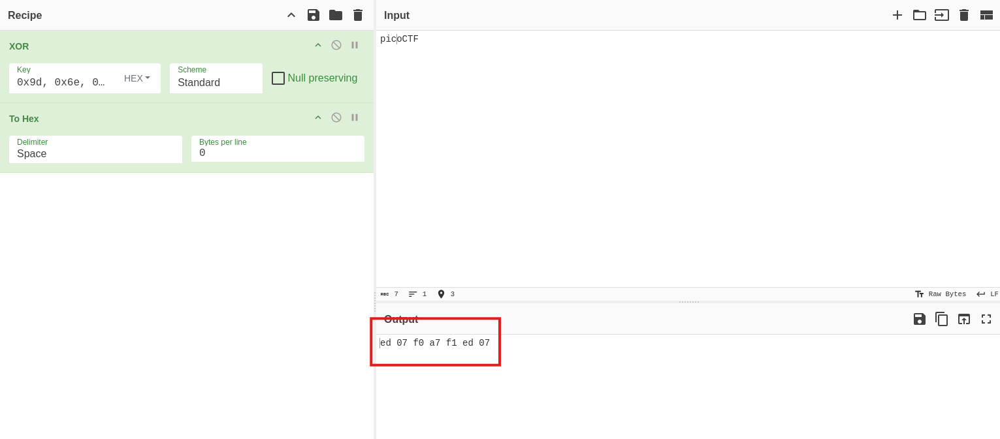

Got this after decompiling the wasm file using `wasm2c`.

```
static const u8 data_segment_data_w2c__d0[] = {
  0x9d, 0x6e, 0x93, 0xc8, 0xb2, 0xb9, 0x41, 0x8b, 0x94, 0xc6, 0xdf, 0x33, 
  0xc0, 0xc5, 0x95, 0xde, 0x37, 0xc3, 0x9f, 0x93, 0xdf, 0x3f, 0xc9, 0xc3, 
  0xc2, 0x8c, 0x32, 0x93, 0x90, 0xc1, 0x8e, 0x65, 0x95, 0x9f, 0xc2, 0x8c, 
  0x36, 0xc8, 0x95, 0xc0, 0x90, 0x00, 0x00, 
};

static const u8 data_segment_data_w2c__d1[] = {
  0xf1, 0xa7, 0xf0, 0x07, 0xed, 
};
```

I used cyberchef and found out that the `data_segment_data_w2c__d1` is the key in the reverse form.

<figure></figure>

So I wrote a small script to get the flag.

```
flag=[0x9d, 0x6e, 0x93, 0xc8, 0xb2, 0xb9, 0x41, 0x8b, 0x94, 0xc6, 0xdf, 0x33, 
  0xc0, 0xc5, 0x95, 0xde, 0x37, 0xc3, 0x9f, 0x93, 0xdf, 0x3f, 0xc9, 0xc3, 
  0xc2, 0x8c, 0x32, 0x93, 0x90, 0xc1, 0x8e, 0x65, 0x95, 0x9f, 0xc2, 0x8c, 
  0x36, 0xc8, 0x95, 0xc0, 0x90, 0x00, 0x00]
key=[0xed, 0x07, 0xf0, 0xa7, 0xf1]
index=0
plain=""
for f in flag:
        plain+=chr(f^key[index%5])
        index+=1
print(plain)
```
And I got the flag.

Flag:
```
picoCTF{37240bd3038b289d3a5c70cbe83a1821}
```