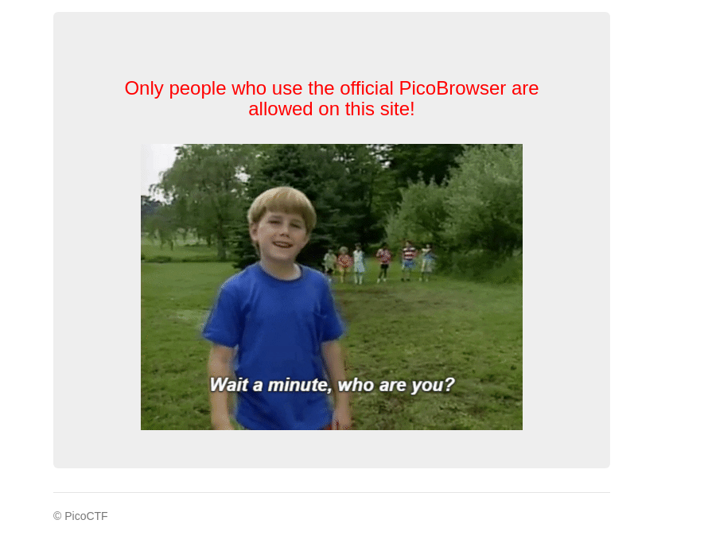
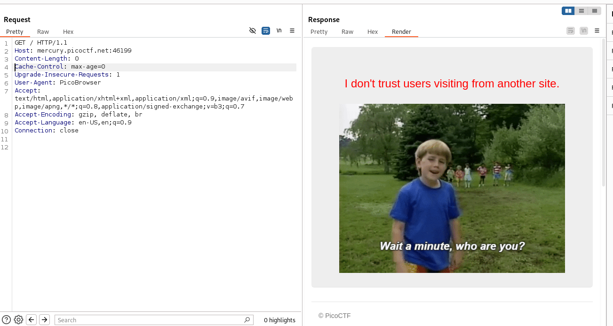
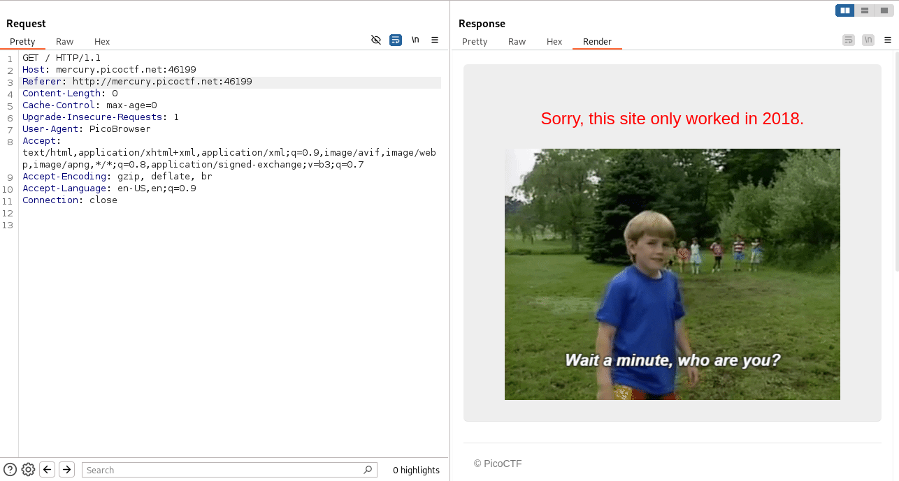
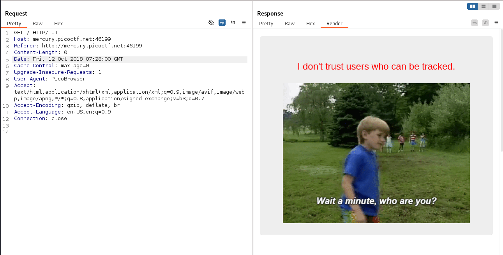
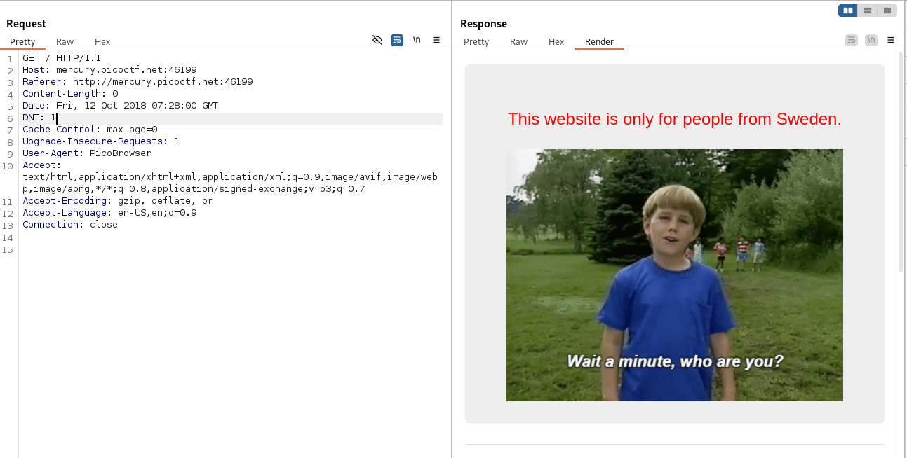
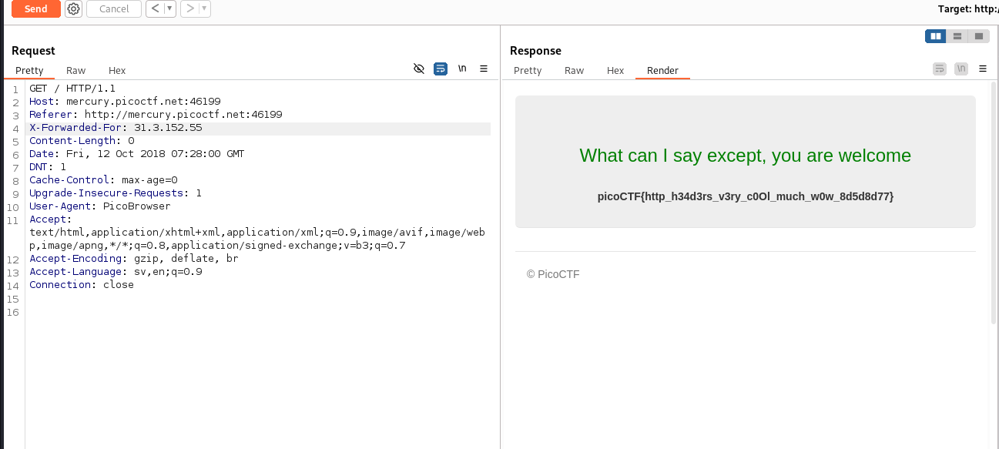

The website said that it's only people who use PicoBrowser are allowed.

<figure></figure>

So I changed the `User-Agent` to `PicoBrowser`. Now it gave another prompt.

<figure></figure>

So I changed the `Referer` header.

<figure></figure>

I gave it a date header to 2018 now.

<figure></figure>

So I added the `DNT` header and set it to `1`.

<figure></figure>

I added a `Accept-Language: sv, en` added `X-Forwarded-For: 31.3.152.55` and got the flag.

<figure></figure>

Flag:
```
picoCTF{http_h34d3rs_v3ry_c0Ol_much_w0w_8d5d8d77}
```