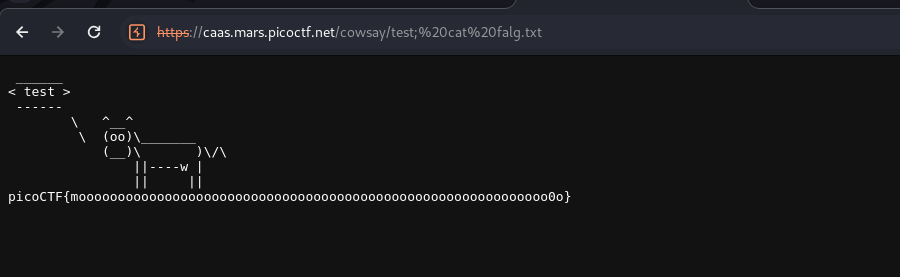

There is command injection in the parameter.

<figure></figure>

I can now read the `falg.txt` file to get the flag

<figure></figure>

Flag:
```
picoCTF{moooooooooooooooooooooooooooooooooooooooooooooooooooooooooooo0o}
```