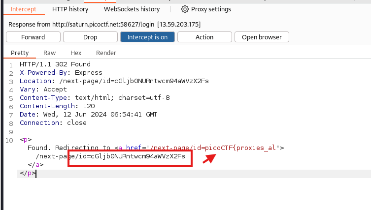
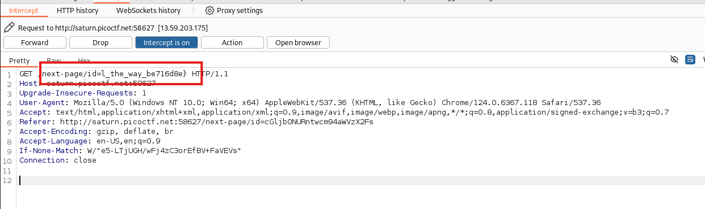

While logging in with the given crednetials it took me through wierd endpoints which I could see in my URL so I captured the endpoints using proxy.

The first ID which was a part flag.

<figure></figure>

Another Base64 ID which I decoded to be second part of the flag.

<figure></figure>

Flag:
```
picoCTF{proxies_all_the_way_be716d8e}
```